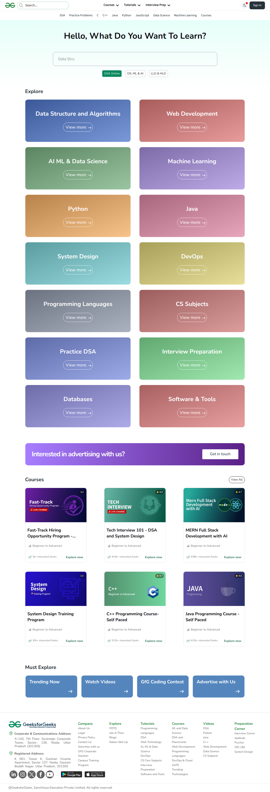

# Visited: https://www.geeksforgeeks.org/
**Time:** Thu May  7 19:49:25 UTC 2026

## Screenshot

## Raw HTML
[page.html](./page.html)

## Downloaded Media (12 files)
## Downloaded Media Files

## Other Links
- [https://assets.geeksforgeeks.org/gfg-assets/_next/static/2026-05-07T07-15-36-721Z/_buildManifest.js](https://assets.geeksforgeeks.org/gfg-assets/_next/static/2026-05-07T07-15-36-721Z/_buildManifest.js)
- [https://assets.geeksforgeeks.org/gfg-assets/_next/static/2026-05-07T07-15-36-721Z/_ssgManifest.js](https://assets.geeksforgeeks.org/gfg-assets/_next/static/2026-05-07T07-15-36-721Z/_ssgManifest.js)
- [https://assets.geeksforgeeks.org/gfg-assets/_next/static/chunks/1119.ecfb8447af8524c5.js](https://assets.geeksforgeeks.org/gfg-assets/_next/static/chunks/1119.ecfb8447af8524c5.js)
- [https://assets.geeksforgeeks.org/gfg-assets/_next/static/chunks/3914.951f46ff700fc404.js](https://assets.geeksforgeeks.org/gfg-assets/_next/static/chunks/3914.951f46ff700fc404.js)
- [https://assets.geeksforgeeks.org/gfg-assets/_next/static/chunks/6218.0324a3867ff382c3.js](https://assets.geeksforgeeks.org/gfg-assets/_next/static/chunks/6218.0324a3867ff382c3.js)
- [https://assets.geeksforgeeks.org/gfg-assets/_next/static/chunks/6492-0f4941e236521dc8.js](https://assets.geeksforgeeks.org/gfg-assets/_next/static/chunks/6492-0f4941e236521dc8.js)
- [https://assets.geeksforgeeks.org/gfg-assets/_next/static/chunks/7792.f845f4f2c2ed5c7d.js](https://assets.geeksforgeeks.org/gfg-assets/_next/static/chunks/7792.f845f4f2c2ed5c7d.js)
- [https://assets.geeksforgeeks.org/gfg-assets/_next/static/chunks/9873.0ef405e16745545f.js](https://assets.geeksforgeeks.org/gfg-assets/_next/static/chunks/9873.0ef405e16745545f.js)
- [https://assets.geeksforgeeks.org/gfg-assets/_next/static/chunks/framework-3412d1150754b2fb.js](https://assets.geeksforgeeks.org/gfg-assets/_next/static/chunks/framework-3412d1150754b2fb.js)
- [https://assets.geeksforgeeks.org/gfg-assets/_next/static/chunks/main-83950604a31ac5bb.js](https://assets.geeksforgeeks.org/gfg-assets/_next/static/chunks/main-83950604a31ac5bb.js)
- [https://assets.geeksforgeeks.org/gfg-assets/_next/static/chunks/pages/_app-2cf0661e13ced1d3.js](https://assets.geeksforgeeks.org/gfg-assets/_next/static/chunks/pages/_app-2cf0661e13ced1d3.js)
- [https://assets.geeksforgeeks.org/gfg-assets/_next/static/chunks/pages/index-a41c541dfc4e5566.js](https://assets.geeksforgeeks.org/gfg-assets/_next/static/chunks/pages/index-a41c541dfc4e5566.js)
- [https://assets.geeksforgeeks.org/gfg-assets/_next/static/chunks/polyfills-c67a75d1b6f99dc8.js](https://assets.geeksforgeeks.org/gfg-assets/_next/static/chunks/polyfills-c67a75d1b6f99dc8.js)
- [https://assets.geeksforgeeks.org/gfg-assets/_next/static/chunks/webpack-668d5b2706f5035d.js](https://assets.geeksforgeeks.org/gfg-assets/_next/static/chunks/webpack-668d5b2706f5035d.js)
- [https://assets.geeksforgeeks.org/gfg-assets/_next/static/css/1142cfe37dce110f.css](https://assets.geeksforgeeks.org/gfg-assets/_next/static/css/1142cfe37dce110f.css)
- [https://assets.geeksforgeeks.org/gfg-assets/_next/static/css/9b3b0bb162558761.css](https://assets.geeksforgeeks.org/gfg-assets/_next/static/css/9b3b0bb162558761.css)
- [https://assets.geeksforgeeks.org/gfg-assets/_next/static/css/e7ea13841c53b53e.css](https://assets.geeksforgeeks.org/gfg-assets/_next/static/css/e7ea13841c53b53e.css)
- [https://fonts.googleapis.com](https://fonts.googleapis.com)
- [https://fonts.googleapis.com/css2?family=Nunito:wght@400;700&family=Source+Sans+3:wght@400;600&display=swap](https://fonts.googleapis.com/css2?family=Nunito:wght@400;700&family=Source+Sans+3:wght@400;600&display=swap)
- [https://fonts.gstatic.com](https://fonts.gstatic.com)
- [https://geeksforgeeksapp.page.link/gfg-app](https://geeksforgeeksapp.page.link/gfg-app)
- [https://in.linkedin.com/company/geeksforgeeks](https://in.linkedin.com/company/geeksforgeeks)
- [https://practice.geeksforgeeks.org/events/rec/job-a-thon/](https://practice.geeksforgeeks.org/events/rec/job-a-thon/)
- [https://twitter.com/geeksforgeeks](https://twitter.com/geeksforgeeks)
- [https://www.facebook.com/geeksforgeeks.org/](https://www.facebook.com/geeksforgeeks.org/)
- [https://www.geeksforgeeks.org/](https://www.geeksforgeeks.org/)
- [https://www.geeksforgeeks.org/about/](https://www.geeksforgeeks.org/about/)
- [https://www.geeksforgeeks.org/about/contact-us/](https://www.geeksforgeeks.org/about/contact-us/)
- [https://www.geeksforgeeks.org/advertise-with-us/](https://www.geeksforgeeks.org/advertise-with-us/)
- [https://www.geeksforgeeks.org/ai-ml-ds/](https://www.geeksforgeeks.org/ai-ml-ds/)
- [https://www.geeksforgeeks.org/aptitude/aptitude-questions-and-answers/](https://www.geeksforgeeks.org/aptitude/aptitude-questions-and-answers/)
- [https://www.geeksforgeeks.org/aptitude/interview-corner/](https://www.geeksforgeeks.org/aptitude/interview-corner/)
- [https://www.geeksforgeeks.org/aptitude/puzzles/](https://www.geeksforgeeks.org/aptitude/puzzles/)
- [https://www.geeksforgeeks.org/blogs/geeksforgeeks-practice-best-online-coding-platform/](https://www.geeksforgeeks.org/blogs/geeksforgeeks-practice-best-online-coding-platform/)
- [https://www.geeksforgeeks.org/c/c-programming-language/](https://www.geeksforgeeks.org/c/c-programming-language/)
- [https://www.geeksforgeeks.org/campus-training-program/](https://www.geeksforgeeks.org/campus-training-program/)
- [https://www.geeksforgeeks.org/category/blogs/?type=recent](https://www.geeksforgeeks.org/category/blogs/?type=recent)
- [https://www.geeksforgeeks.org/computer-science-fundamentals/programming-language-tutorials/](https://www.geeksforgeeks.org/computer-science-fundamentals/programming-language-tutorials/)
- [https://www.geeksforgeeks.org/copyright-information/](https://www.geeksforgeeks.org/copyright-information/)
- [https://www.geeksforgeeks.org/courses](https://www.geeksforgeeks.org/courses)
- [https://www.geeksforgeeks.org/courses/category/cloud-devops](https://www.geeksforgeeks.org/courses/category/cloud-devops)
- [https://www.geeksforgeeks.org/courses/category/development-testing](https://www.geeksforgeeks.org/courses/category/development-testing)
- [https://www.geeksforgeeks.org/courses/category/dsa-placements](https://www.geeksforgeeks.org/courses/category/dsa-placements)
- [https://www.geeksforgeeks.org/courses/category/gate](https://www.geeksforgeeks.org/courses/category/gate)
- [https://www.geeksforgeeks.org/courses/category/machine-learning-data-science](https://www.geeksforgeeks.org/courses/category/machine-learning-data-science)
- [https://www.geeksforgeeks.org/courses/category/programming-languages](https://www.geeksforgeeks.org/courses/category/programming-languages)
- [https://www.geeksforgeeks.org/courses/category/trending-technologies/](https://www.geeksforgeeks.org/courses/category/trending-technologies/)
- [https://www.geeksforgeeks.org/courses/cpp-programming-basic-to-advanced/](https://www.geeksforgeeks.org/courses/cpp-programming-basic-to-advanced/)
- [https://www.geeksforgeeks.org/courses/data-science-live](https://www.geeksforgeeks.org/courses/data-science-live)
- [https://www.geeksforgeeks.org/courses/dsa-self-paced](https://www.geeksforgeeks.org/courses/dsa-self-paced)

## Stats
- Links: 112
- Media: 12
